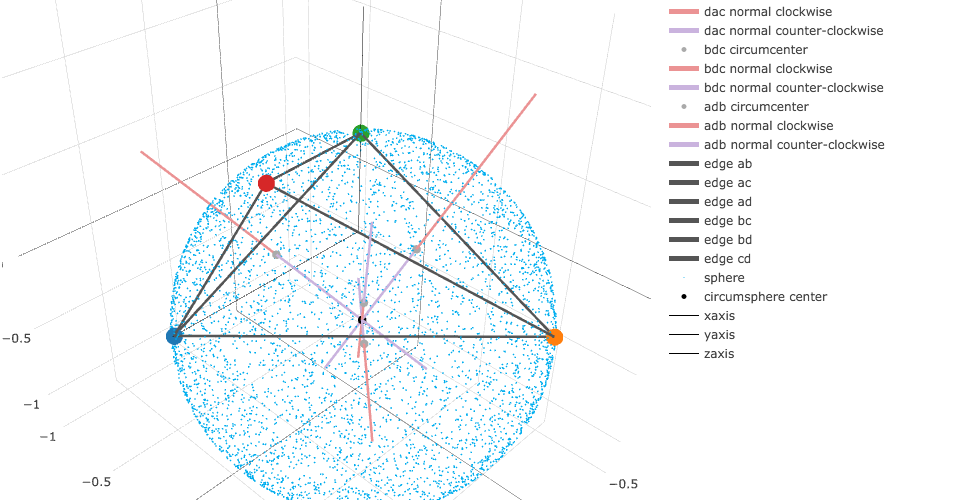

# Geometric Primitives

This code was submitted for the first assignment of MATH 290, Digital 3D Geometry, taught in the Spring of 2016 at Duke University.

For more information on this course assignment, please visit

http://www.ctralie.com/Teaching/COMPSCI290/Assignments/Mini1_GeometricPrimitives/

Instructor: Chris Tralie

Student: Brooks Mershon



## Quickstart

Open *index.html* to see the circumsphere of a tetrahedron.

## Development

2 hours spent on Task 1-3: **Spent primarily on figuring out how to test problems like these without a GUI**.

45 min spent on Task 4: Reading Wikipedia pages, implementing Cramer's rule, writing a few tests.

20 min spent on Task 5: Mostly chasing a bug caused by a typo.

5 hours spent on Extra Credit: Spent figuring out how numerical precision presents a problem in 3D. Also spent tinkering with *exactly* what colors and dimensions to use for visual markers, because aesthetics is important.

## Impressions

This is a fun introduction to the material and very manageable in scope. I particularly like the idea of the last two tasks representing a induction on the number of dimensions in the problem. It is possible to reuse code written in Task 4 for subsequent tasks; that is pretty neat.

The extra credit caused me to fix bugs in previous sections which did not cause problems until we start doing computations in 3D. Self-exploration of topics like least squares solutions and numerical precision naturally followed. In fact, I think of the extra credit as a guided exporation into what can quickly go wrong in 3D.

## Testing

In the root directory, install all required dependencies as specified in *package.json* by running:

```bash
npm install
```

To run all tests and build the *GeomPrimitives file from source*:

```
npm run submit
```

This runs a script specified in *package.json* that does a few things. First, it compiles the code in the *src/* folder into a module that works in a Node.js environment as well as in the browser. This file resides in *build/*.

Because this assignment expects a file called *GeoPrimitives.js*, which exposes the main functions to the global namespace when the file is included as a script in the browswer, npm submit creates *GeomPrimitives.js* by concatenating *build/gl-geom.js* and the following snippet:

```js

// expose module to global namespace
for (var property in gl_geom) {
  window[property] = gl_geom[property];
}
```

This build pattern closely adheres to a module pattern propsed by Mike Bostock for plugins to the D3 data visualizaiton library. Why go through all the trouble? For future assignments, I hope to keep things modular and develop plugins in the style of D3 plugins. This is a test run.